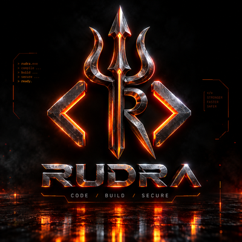

<p align="center">
  
</p>

# RUDRA 🔱 — A Fast, Safe, and Easy Systems Language

RUDRA is a compiled programming language with **C-class speed**, real
**memory safety** (no null, bounds-checked, use-after-free caught), a modern
type system (generics, trait bounds, sum types, `Option`/`Result`), and an
easy, readable syntax.

This repository distributes the **RUDRA toolchain binaries**. RUDRA is free to
use. The compiler source is proprietary and not included.

## Install (Linux x86_64)

```bash
tar -xzf rudra-1.0.0-linux-x86_64.tar.gz
cd rudra-public
./install.sh
rudra version
```

A C compiler (`gcc`) must be present on your machine — RUDRA compiles to native
code through it.

## The Tools

| Tool | Purpose |
|------|---------|
| `rudra` | driver: create, run, build, format, test |
| `rudrac` | compiler: one `.rux` file → native binary |
| `ruxpkg` | package manager (local registry) |
| `rudra-lsp` | language server (editor diagnostics) |

## Your First Program

```rudra
fn main() {
    print("Hello, RUDRA!");
}
```

```bash
rudrac hello.rux --run
```

## License

Free to use. See LICENSE. Source is proprietary (© RAKSHANEX).


## VS Code Extension

RUDRA has an official VS Code extension (syntax highlighting + live error
diagnostics), published by **RAKSHANEX TECHNOLOGIES**.

**Install from the Marketplace (easiest):**
- In VS Code: Extensions (Ctrl+Shift+X) → search **"RUDRA"** → Install
- Or run:
  ```bash
  code --install-extension rakshanex.rudra
  ```
- Marketplace page: https://marketplace.visualstudio.com/items?itemName=rakshanex.rudra

The extension uses the `rudra-lsp` binary (included in this toolchain). If it is
not on your PATH, set `rudra.lspPath` in VS Code settings to its absolute path.
